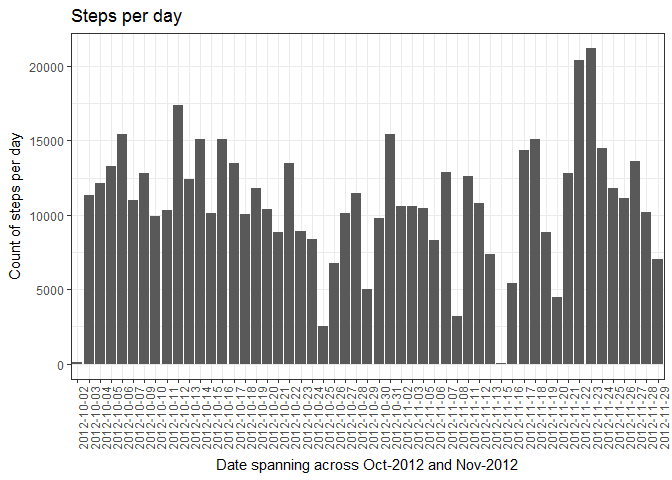
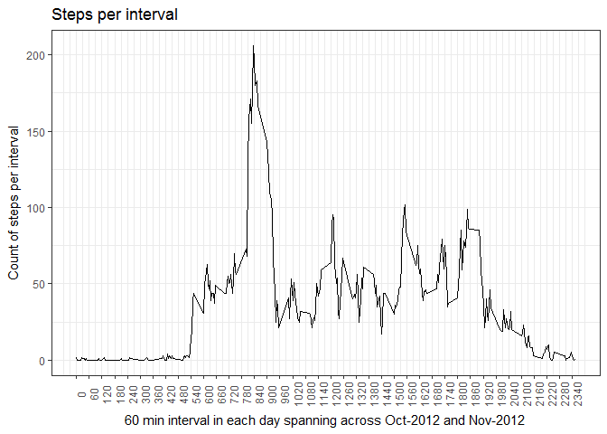

## Loading and preprocessing the data

### Steps:-
#### 1. Set working directory equivalent to your workspace 
#### 2. Load required packages if required.
#### 3. Check if unzipped activity.csv already exists in working directory.
#### 4. If it doesn't, unzip the file and then read it using read.csv
#### 5. Remove NA rows using complete.cases as index to original dataset.

```r
  if (!require("scales")){
    install.packages("scales")
  }
  if (!require("ggplot2")){
    install.packages("ggplot2")
  }
  if (!require("plyr")){
    install.packages("plyr")
  }
  require("dplyr")
  require("scales")
  require("ggplot2")


  
  folder <- "activity.zip"
  file   <- "activity.csv"
  
  if (file.exists(file)){
      ## file folder already exists in the WD
  }else{
      if (file.exists(folder)){
      ## zip file already exists
      }
      unzip(folder) 
  }
```


```r
  StepsCountDS <- read.csv(file)
  
  ## Remove non NA rows from StepsCountDS Dataset
  
  StepsCountNonNA <- StepsCountDS[complete.cases(StepsCountDS), ]
```

## What is mean total number of steps taken per day?

### Steps:-
#### 1. Calculate sum of steps taken per day using aggregate function and create a new data frame
#### 2. Make a histogram using ggplot2 system with x-axis = each day and y-axis as number of steps per day.
#### 3. Calculate mean and median of no of steps for the whole duration spanning across 2 months - Oct-2012 and Nov-2012.

```r
 ## 1st plot
  
  ## calculate total number of steps taken per day
  
  TotalNumStepsPerDay <- aggregate(StepsCountNonNA$steps, by = list(StepsCountNonNA$date), FUN = "sum")
  
  plot1 <- ggplot(TotalNumStepsPerDay, aes(x=Group.1, y=x)) + geom_bar(stat="identity") +
              ylab("Count of steps per day") + xlab("Date spanning across Oct-2012 and Nov-2012") +
              theme_bw() + theme(axis.text.x = element_text(angle=90)) + ggtitle("Steps per day")
  
  print(plot1)
```

<!-- -->

```r
  plot1mean   <- as.numeric(mean(TotalNumStepsPerDay$x))
  plot1median <- as.numeric(median(TotalNumStepsPerDay$x))
```
* Mean of total number of steps per day:   1.0766189\times 10^{4}
* Median of total number of steps per day: 1.0765\times 10^{4}


## What is the average daily activity pattern?
### Steps:-
#### 1. Calculate sum of steps taken per interval using aggregate function and create a new data frame
#### 2. Make a line plot using ggplot2 system with x-axis = 5 min intervals and y-axis as number of steps per day.
#### 3. calculate interval having maxium steps during the whole of duration from 1-Oct-2012 to 30-Nov-2012.

```r
## 2nd plot
  
  ## Total number of steps in each 5 min interval
  
  TotalNumStepsPerInt <- aggregate(StepsCountNonNA$steps, by = list(StepsCountNonNA$interval), 
                                   FUN = "mean")
  names(TotalNumStepsPerInt) <- c("interval", "steps")
  
  TotalNumStepsPerInt$steps <- round(TotalNumStepsPerInt$steps)
  
  plot2 <- ggplot(TotalNumStepsPerInt, aes(x=interval, y=steps)) + geom_line() + 
              scale_x_continuous(breaks = seq(min(TotalNumStepsPerInt$interval), 
                                              max(TotalNumStepsPerInt$interval),60)) +
              ylab("Count of steps per interval") + xlab("60 min interval in each day spanning across Oct-2012 and Nov-2012") +
              theme_bw() + theme(axis.text.x = element_text(angle=90)) + ggtitle("Steps per interval")
  
  print(plot2)
```

<!-- -->

```r
  plot2MaxStepsInt <- TotalNumStepsPerInt[which.max(TotalNumStepsPerInt$steps), 1]
```
* Which interval contains max number of Steps: 835

## Imputing missing values
### Steps:-
#### 1. Create a dataset containing NA observations from original data set.
#### 2. Merge dataset containing during above plot for aggregate sum of steps per interval during Oct and Nov 2012 using interval as base of left inner join.
#### 3. Now, select only interval, steps and date to a new data set to eliminate NA observations.
#### 4. Combine Non NA data set created during first step and this new data set to produce new data set containing mean of 5 min interval in place of NA values for the number of steps.
#### 5. Make a histogram using ggplot2 system with x-axis = each day and y-axis as number of steps per day.
#### 3. Calculate mean and median of no of steps for the whole duration spanning across 2 months - Oct-2012 and Nov-2012 on this new data set.

```r
  StepsCountNA <- StepsCountDS[!complete.cases(StepsCountDS), ]
  
  replaceCountNA <- merge(x=StepsCountNA, y = TotalNumStepsPerInt, by = c("interval"), all.x = TRUE)
  
  StepsCountNAbyMean <- replaceCountNA[, c("interval", "date", "steps.y")]
  
  names(StepsCountNAbyMean)[3] <- "steps"
  
  StepsCount <- rbind(StepsCountNonNA, StepsCountNAbyMean)
  
  WholeNumStepsPerDay <- aggregate(StepsCount$steps, by = list(StepsCount$date), FUN = "sum")
  
  plot3 <- ggplot(WholeNumStepsPerDay, aes(x=Group.1, y=x)) + geom_bar(stat="identity") +
              ylab("Count of steps per day") + xlab("Date spanning across Oct-2012 and Nov-2012") +
              theme_bw() + theme(axis.text.x = element_text(angle=90)) + ggtitle("Steps per day")
  
  print(plot3)
```

<!-- -->

```r
  plot3sumofNA <- sum(is.na(StepsCountDS))
  plot3mean    <- as.numeric(mean(WholeNumStepsPerDay$x))
  plot3median  <- as.numeric(median(WholeNumStepsPerDay$x))
```
* Number of observations containing NA: 2304
* Mean of number of steps per day:      1.0765639\times 10^{4}
* Median of number of steps per day:    1.0762\times 10^{4}
  
## Are there differences in activity patterns between weekdays and weekends?
### Steps:-
#### 1. Create a new column in new data set created in above step containing weekend for Saturday and Sunday and weekday for rest of days.
#### 2. Convert this variable into factor variable
#### 3. Create a line plot using this factor variable as a grouping criteria to create 2 graphs one for weekday and one for weekend containing x-axis = 5 min intervals and y-axis as number of steps.


```r
  StepsCount$day <- ifelse(weekdays(as.Date(StepsCount$date)) %in% c("Saturday",   
                                                                    "Sunday"),"weekend", "weekday")
  
  WholeNumStepsPerInt <- aggregate(StepsCount$steps, by = list(StepsCount$interval, 
                                                               StepsCount$day), FUN = "mean")
  names(WholeNumStepsPerInt) <- c("interval", "day", "steps")
  
  WholeNumStepsPerInt$steps <- round(WholeNumStepsPerInt$steps)
  
  WholeNumStepsPerInt$day <- factor(WholeNumStepsPerInt$day)
  
  
  plot4 <- ggplot(WholeNumStepsPerInt, aes(x=interval, y=steps)) + geom_line(color = "blue") + 
                  ylab("Number of steps") + xlab("Interval") +
                  theme_bw() + facet_grid(WholeNumStepsPerInt$day~.)
  
 
  
  print(plot4)
```

<!-- -->
